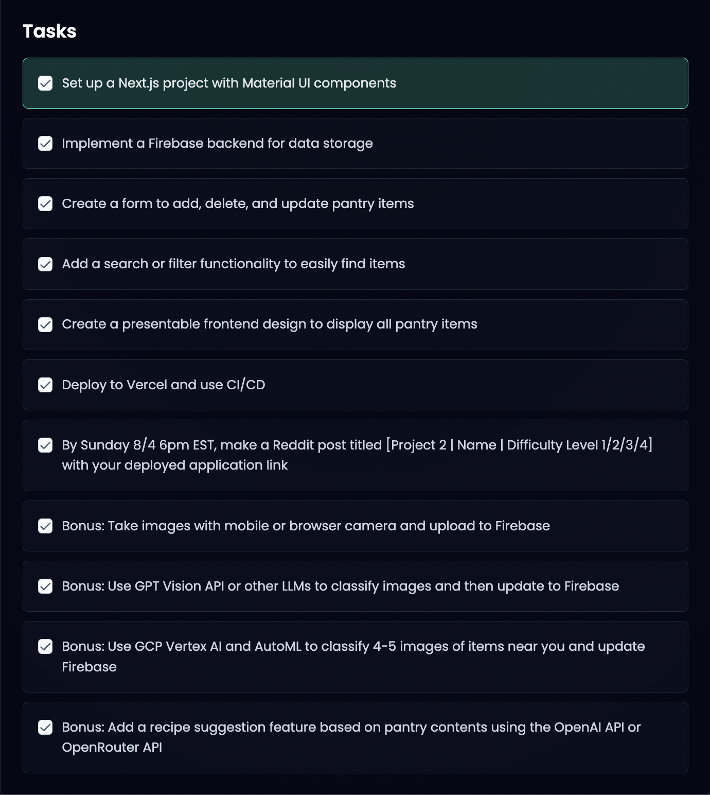

# Pantry Tracker

## Project Overview

This project is an Pantry Tracker specifically designed for food items, developed as part of the Headstarter AI Fellowship. It features real-time inventory tracking and smart recipe suggestions based on available ingredients. The system allows users to efficiently manage their pantry, reduce food waste, and ensure they always have the necessary ingredients on hand.

## Tasks



## Key Features

- **Real-time Inventory Tracking**: Keep track of your pantry items with up-to-date information on what you have in stock.
- **Smart Recipe Suggestions**: Get personalized recipe ideas based on the ingredients you already have, helping you make the most of your pantry.
- **User-friendly Interface**: The application is designed with an intuitive interface, making it easy for users to navigate and manage their inventory.
- **Notifications and Alerts**: Receive timely reminders when items are running low or nearing expiration, ensuring you never run out of essentials.
- **Data Analysis**: Visualize your pantry usage trends with comprehensive charts and graphs, helping you make informed decisions about restocking and consumption patterns.

## Components, Pages, Utilities and Firebase
### Components

- **AddItemModal**:
  - Modal window for adding new items to the pantry.
  - Includes fields for item details and quantity.

- **ImageCapture**:
  - Captures and uploads images for pantry items or recipes.
  - Supports camera and file upload.

- **InventoryAnalysis**:
  - Displays visual analysis and statistics of pantry inventory.
  - Shows item counts, expiration dates, and usage trends.

- **InventoryList**:
  - Lists all pantry items with details like name, quantity, and expiration date.
  - Features for editing or removing items.

- **Navbar**:
  - Navigation bar for accessing different sections of the application.
  - Links to Dashboard, Inventory, Recipe Suggestions, etc.

- **Pantry**:
  - Main component showing the current state of the pantry.
  - Integrates and displays item details.

- **ProfileModal**:
  - Modal for viewing and editing user profile information.
  - Includes options to update personal details and preferences.

- **RecipeSuggestions**:
  - Provides recipe ideas based on available pantry items.
  - Lists recipes with ingredients and instructions.

### Pages

- **analysis/page.js**:
  - Displays inventory analysis and insights.

- **dashboard/page.js**:
  - Overview of the pantry and key metrics.

- **generate-recipes/page.js**:
  - Generates and shows recipe suggestions based on pantry contents.

### Utilities

- **exportPdf.js**:
  - Exports inventory data or analysis reports as PDF files.

### Firebase

- **config.js**:
  - Initializes and connects to Firebase services.

## Technologies Used

- [Next.js](https://nextjs.org/)
- [React](https://reactjs.org/)
- [Firebase](https://firebase.google.com/)
- [OpenRouter](https://openrouter.ai/)
- [Material-UI](https://material-ui.com/)
- [Framer Motion](https://www.framer.com/motion/)
- [Axios](https://axios-http.com/)
- [Chart.js](https://www.chartjs.org/)
- [Lodash](https://lodash.com/)
- [React DatePicker](https://reactdatepicker.com/)
- [React Toastify](https://fkhadra.github.io/react-toastify/) (notification system)
- [React Table](https://react-table.tanstack.com/)
- [TensorFlow.js](https://www.tensorflow.org/js)
- [html2canvas](https://html2canvas.hertzen.com/)
- [jsPDF](https://parall.ax/products/jspdf)
- [Emotion](https://emotion.sh/docs/introduction) (styled components)
- [Notistack](https://iamhosseindhv.com/notistack) (notification system)


## Live Demo

Check out the live demo deployed on Vercel: [\[Click Here!\]](https://pantry-tracker-ashy-six.vercel.app/)


## Getting Started

To get a local copy up and running, follow these steps:

1. Clone the repository:

```bash
git clone https://github.com/aishwaryamensinkai/Pantry-Tracker.git
```

2. Navigate to the project directory:

```bash
cd Pantry-Tracker
```

3. Install dependencies:
```bash
npm install
```

4. Set up environment variables:
Create a `.env.local` file in the root directory of your project. Add the following environment variables to the `.env.local` file:

```bash
NEXT_PUBLIC_FIREBASE_API_KEY=your_firebase_api_key
NEXT_PUBLIC_FIREBASE_AUTH_DOMAIN=your_firebase_auth_domain
NEXT_PUBLIC_FIREBASE_PROJECT_ID=your_firebase_project_id
NEXT_PUBLIC_FIREBASE_STORAGE_BUCKET=your_firebase_storage_bucket
NEXT_PUBLIC_FIREBASE_MESSAGING_SENDER_ID=your_firebase_messaging_sender_id
NEXT_PUBLIC_FIREBASE_APP_ID=your_firebase_app_id
NEXT_PUBLIC_FIREBASE_MEASUREMENT_ID=your_firebase_measurement_id
NEXT_PUBLIC_FIREBASE_LLAMA_KEY=your_llama_key
```

Replace the placeholder values (`your_firebase_api_key`, `your_firebase_auth_domain`, etc.) with your actual Firebase and OpenAI credentials.

To set up your Firebase project and obtain these credentials:
i. Go to the [Firebase Console](https://console.firebase.google.com/)
ii. Click on "Add project" or select an existing project
iii. Follow the setup wizard to create your project
iv. Once your project is ready, click on the web icon (`</>`) to add a web app to your project
v. Register your app and Firebase will provide you with the configuration object containing these values

For the LLAMA API key, sign up at the [OpenRouter](https://openrouter.ai/) to get your API key.


5. Run the development server:

```bash
npm run dev
```

6. Open [http://localhost:3000](http://localhost:3000) with your browser to see the result.

## Troubleshooting

If you encounter any issues while setting up or running the project, try the following:

1. Ensure all dependencies are installed:
```bash
npm install
```

2. Clear Next.js cache:
```bash
rm -rf .next
```

3. Rebuild the project:
```bash
npm run build
```

4. For LLAMA API issues, verify that your API key is correctly set in the `.env.local` file and that you have sufficient credits in your OpenAI account.

## Contributing

Contributions, issues, and feature requests are welcome! Feel free to raise it.

## Acknowledgments

- Headstarter AI Fellowship for the opportunity and support
- LLAMA for providing the powerful API
- All contributors and reviewers

## Resources

The file structure is

  ```bash
  .
  ├── README.md
  ├── app
  │   ├── analysis
  │   │   └── page.js
  │   ├── components
  │   │   ├── AddItemModal.js
  │   │   ├── ImageCapture.js
  │   │   ├── InventoryAnalysis.js
  │   │   ├── InventoryList.js
  │   │   ├── Navbar.js
  │   │   ├── Pantry.js
  │   │   ├── ProfileModal.js
  │   │   └── RecipeSuggestions.js
  │   ├── dashboard
  │   │   └── page.js
  │   ├── firebase
  │   │   └── config.js
  │   ├── generate-recipes
  │   │   └── page.js
  │   ├── globals.css
  │   ├── layout.js
  │   ├── page.js
  │   └── utils
  │       └── exportPdf.js
  ├── jsconfig.json
  ├── next.config.mjs
  ├── package-lock.json
  ├── package.json
  ├── postcss.config.mjs
  ├── public
  │   ├── assets
  │   │   ├── logo.png
  │   │   ├── pantry-image.jpg
  │   │   └── tracking.jpg
  │   ├── favicon.ico
  │   ├── next.svg
  │   └── vercel.svg
  └── tailwind.config.js
  ```

- To include the tree structure of the project install tree by using command in mac
  ```bash
  brew install tree
  tree -L 5 -I node_modules
  ```
- How to configure Google Analytics watch this video https://www.youtube.com/watch?v=Z3p6qeU76V0

- Use this link to test Pingdom Website Speed Test https://tools.pingdom.com/#644b651b43400000

## Deploy on Vercel

The easiest way to deploy your Next.js app is to use the [Vercel Platform](https://vercel.com/new?utm_medium=default-template&filter=next.js&utm_source=create-next-app&utm_campaign=create-next-app-readme) from the creators of Next.js.

Check out our [Next.js deployment documentation](https://nextjs.org/docs/deployment) for more details.
